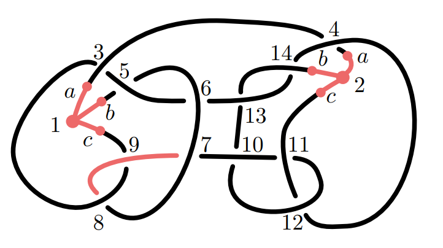

# Wirtinger Number of a Graph

Python code to calculate the Wirtinger number of a graph.

## Description

Let `gc` be the Gauss code corresponding to a subdivision of theta graph. The outline of the program is:

1. List all *strands* of the `gc`. A strand of a spatial graph diagram is one of the following:
   - a *pod*,
   - an arc connecting an end of pod to an undercrossing (a negative number),  
   - an arc connecting two undercrossings.
2. Set `k=1`. Get the list of `k` *seeds*, that is the list all combinations of `k` strands and among them, there is at least one pod. 
3. Pick a combination of seeds and color each seed by one color. The truncated graph is the original graph minus the pods which are not in the list of seeds (if any).
4. Maximally extend the truncated graph by coloring moves: at the current strand, check if the next strand is uncolored, and if so:
    - *Move of type 1 (extending at an endpoint of a pod)*: color the next strand.
    - *Move of type 2 (extending at an under node)*: if the overstrand is colored, then color the next understrand. 
5. If the whole truncated graph is colored, return `k`. If not, pick another combinations of seeds and repeat from Step 3. 
6. If the truncated graph is not *colored* with any combination of `k` colors, repeat this process with `k+1` colors.

  
<p align="center">
  <br>
   Coloring moves.
</p>

## Examples

##### 1. For a Gauss code:

``` 
# Example Gauss code input
my_gauss = [
   ['a1', 3, -4, 'a2'],
   ['b1', -5, 6, 7, -8, 9, -7, 10, -11, 12, -10, -13, 14, 'b2'],
   ['c1', -9, 8, -3, 5, -6, 13, -14, 4, -12, 11, 'c2']
]
[wirtinger, seed] = get_wirtinger(my_gauss)
print("Wirtinger ", wirtinger, "\nseed ", seed)
```

<p align="center">
  <br>
  This diagram is 3-Wirtinger colorable using the seed <code>[['a1', 'b1', 'c1'], ['a2', 'b2', 'c2'], [-8, 9, -7]]</code>.
</p>


##### 2. For an .xlsx file of multiple Gauss codes:  
``` 
# Example: 
process_wirtinger('excel/list_graphs_test.xlsx', 'excel/output_wirtinger_test.xlsx')
```


