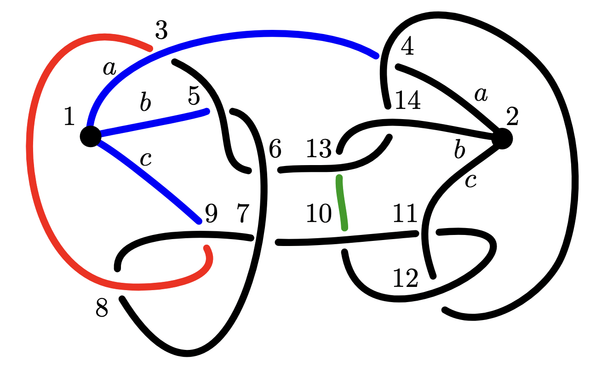

# Wirtinger number of a graph

Python code to calculate the **Wirtinger number** of a spatial graph.

## Description

Let `gc` be the Gauss code corresponding to a subdivision of a theta graph. This program computes its Wirtinger number using the following procedure:

1. **List all *strands* of the Gauss code `gc`**. A strand in a spatial graph diagram can be:
   - a **pod**,
   - a **normal arc**: an arc connecting a pod endpoint to an undercrossing (a negative number),
   - an arc connecting two undercrossings.

   Each pod is **maximally extended** to form an `extended_pod`:
   - **Move type 1 (extending at a pod endpoint)**: color the next strand.
   - If two pods extend to the same `extended_pod`, keep only one.
   - Normal arcs and `extended_pods` become **seed candidates**.

2. **Initialize `wirt = 2 × len(pods) × total number of strands`**. Start from `k = 1`, and for all `k ≤ ceil(wirt)` and total number of strands:

3. **Generate all combinations of `k` seed candidates** (called **seeds**).

4. **Color the graph using a given seed combination**:
   - The **truncated graph** is the original graph minus any pods not in the current seed list.
   - Extend coloring using the following move:
     - **Move type 2 (extending at an under node)**: if the overstrand is colored, color the adjacent understrand.

5. **If the entire truncated graph is colored**:
   - Compute the **half-weight** of the seed list, defined as half the sum of the weights of each seed (where the weight is the number of negative entries—i.e., under-nodes—in the seed).
   - If `half-weight < wirt`, update `wirt = half-weight`.
   - Add the current seed list to `colorable_list_of_seeds`.

6. **Return**:
   - the **Wirtinger number** `wirt`, and
   - the list(s) of seeds from `colorable_list_of_seeds` that achieve this `wirt`.

<p align="center">
  <br>
  <em>Coloring moves illustration</em>
</p>


## Examples

### 1. Gauss code input

```python
# Example Gauss code
gc = [
   ['a1', 3, -4, 'a2'],
   ['b1', -5, 6, 7, -8, 9, -7, 10, -11, 12, -10, -13, 14, 'b2'],
   ['c1', -9, 8, -3, 5, -6, 13, -14, 4, -12, 11, 'c2']
]
[wirtinger, seeds] = get_wirtinger(gc) 
```

<p align="center">
  <br>
  This diagram is 3.5-Wirtinger colorable using the red, green, blue seeds.
</p>


### 2. Batch processing from excel

```python
# Example
process_wirtinger('excel/list_graphs_test.xlsx', 'excel/output_wirtinger_test.xlsx')
```
The output is saved as an Excel file with three columns: Gauss code, Wirtinger number and list of all possible colorable seed combinations.


